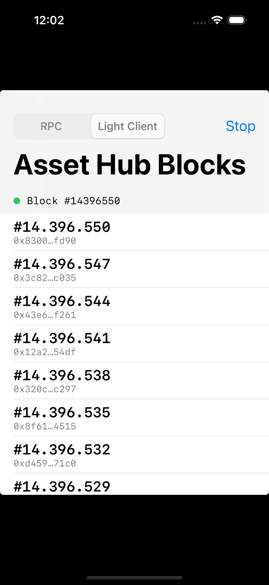

# subxt-ios-demo

A proof-of-concept iOS app that subscribes to Polkadot Asset Hub blocks using [subxt](https://github.com/nicknisi/subxt), with the Rust core exposed to Swift via [UniFFI](https://mozilla.github.io/uniffi-rs/).

The goal is to demonstrate that a shared Rust core (subxt) can power blockchain connectivity across platforms: iOS (this repo), browser/WASM ([subxt-wasm-demo](https://github.com/nicknisi/subxt-wasm-demo)), and potentially Android, desktop, etc.



Supports two connection modes:

- **Light Client** (default) -- connects directly to the Polkadot network via an embedded smoldot light client. No trusted third-party RPC endpoint required.
- **RPC** -- connects to a WebSocket RPC endpoint (e.g. `wss://polkadot-asset-hub-rpc.polkadot.io`).

## Prerequisites

- Xcode 15+
- Rust toolchain (`rustup`)
- [xcodegen](https://github.com/yonaskolb/XcodeGen) (`brew install xcodegen`)

## Build & Run

```bash
# One-time setup: add iOS targets
make setup

# Build everything: Rust libs, UniFFI bindings, XCFramework, Xcode project
make all

# Open in Xcode and run on simulator
open SubxtDemo/SubxtDemo.xcodeproj
```

Or build and run from the command line:

```bash
make all
xcodebuild -project SubxtDemo/SubxtDemo.xcodeproj \
  -scheme SubxtDemo -sdk iphonesimulator \
  -destination 'platform=iOS Simulator,name=iPhone 16' build

xcrun simctl install booted \
  ~/Library/Developer/Xcode/DerivedData/SubxtDemo-*/Build/Products/Debug-iphonesimulator/SubxtDemo.app
xcrun simctl launch booted com.example.SubxtDemo
```

## Project Structure

```
src/lib.rs              Rust library: subxt block subscription, UniFFI exports
Cargo.toml              Rust dependencies (subxt, uniffi, tokio)
Makefile                Build orchestration (cargo, uniffi-bindgen, xcodebuild)
polkadot.json           Polkadot relay chain spec (with TCP bootnodes for native)
asset_hub.json          Asset Hub parachain chain spec
uniffi-bindgen/         UniFFI bindgen CLI binary
SubxtDemo/
  project.yml           xcodegen project spec
  SubxtDemoApp.swift    App entry point
  ContentView.swift     SwiftUI view (block list, status bar, mode picker)
  BlockSubscriber.swift ViewModel: drives the Rust subscription from Swift
```

## Architecture

```
+---------------------------------+
|  SwiftUI (ContentView)          |
|  BlockSubscriber (@MainActor)   |
+---------------+-----------------+
                | UniFFI (generated Swift bindings)
+---------------v-----------------+
|  Rust (src/lib.rs)              |
|  subscribe(mode, listener)      |
|  +----------------------------+ |
|  | Light Client (smoldot)     | |
|  | or RPC (jsonrpsee)         | |
|  +----------------------------+ |
|  subxt -> OnlineClient          |
|  stream_all_blocks()            |
+---------------------------------+
```

The Rust library exposes a single `subscribe(mode, listener)` function via UniFFI. Swift implements the `BlockListener` trait (protocol) to receive callbacks on status changes, new blocks, and errors. The `SubscriptionHandle` returned by `subscribe` supports cancellation and auto-cancels on deallocation.

## Key Details

**UniFFI FFI pattern**: Rust defines a `BlockListener` trait with `#[uniffi::export(with_foreign)]`. Swift implements this protocol. Callbacks dispatch to `@MainActor` via `Task` to update the UI safely.

**Light client on native iOS**: Smoldot's native platform does not support WSS (WebSocket Secure) connections. The chain specs include plain TCP bootnode addresses (`/dns/.../tcp/PORT/p2p/PEERID`) so the native smoldot transport can connect. The WASM version of this demo uses WSS via the browser's WebSocket API.

**Tokio runtime**: A shared `OnceLock<Runtime>` provides a multi-threaded tokio runtime. UniFFI exports are synchronous functions that spawn async work onto this runtime and return a handle immediately.

## See Also

- [subxt](https://github.com/nicknisi/subxt) -- Rust library for interacting with Substrate-based chains
- [UniFFI](https://mozilla.github.io/uniffi-rs/) -- Mozilla's FFI bindgen for Rust
